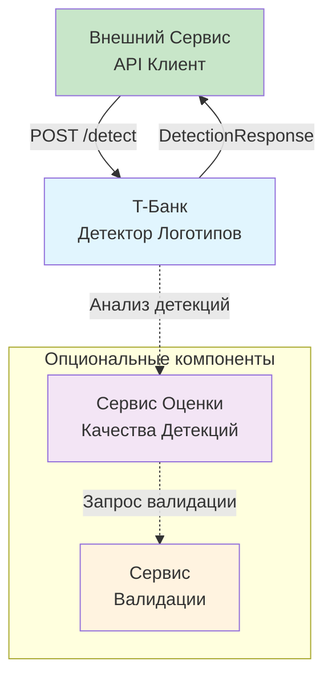
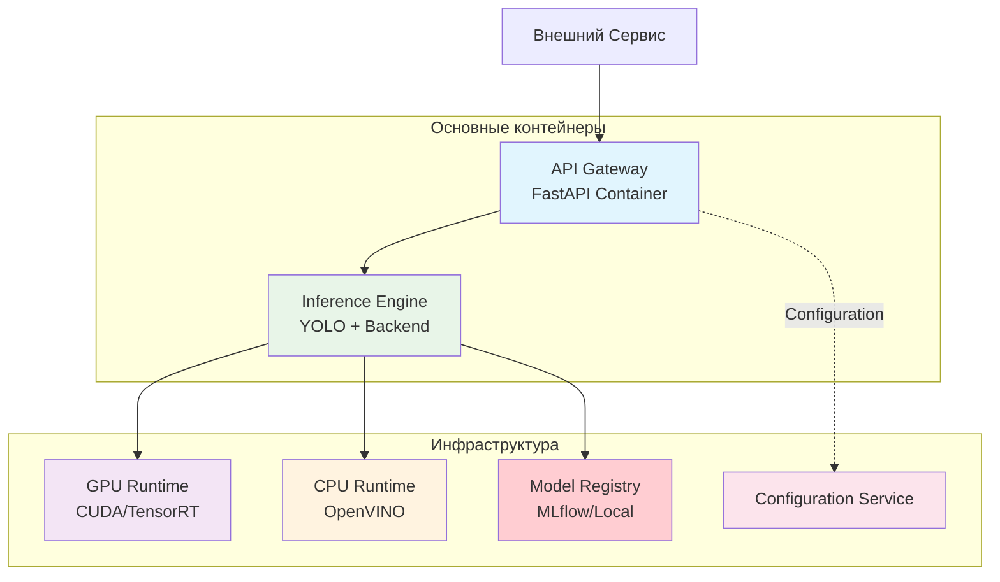

# T-Банк Детектор Логотипов

## Описание сервиса

REST API сервис для автоматической детекции логотипа Т-Банка на изображениях с использованием предобученной модели YOLOv11. Сервис предназначен для обнаружения стилизованной буквы "Т" в щите (цвет логотипа может быть как желтый, так и произвольный) и игнорирования логотипов "Тинькофф".

### Основные характеристики

- **Порт:** 8000
- **Эндпоинт:** POST /detect
- **Время обработки:** ≤ 10 секунд на изображение
- **Поддержка GPU/CPU:** CUDA для GPU, OpenVINO для CPU
- **Форматы изображений:** JPEG, PNG, BMP, WEBP
- **Модель:** YOLOv11 (Ultralytics) с поддержкой различных бэкендов

### Архитектура системы

#### Основные компоненты:

1. **T-Банк Детектор Логотипов** - основной сервис детекции
2. **Сервис Оценки Качества Детекций** (опционально) - анализ уверенности предсказаний
3. **Сервис Валидации** (опционально) - дополнительная проверка сложных случаев

#### C4 Диаграмма архитектуры (System Context)



**Описание:** Основной сервис детекции принимает запросы и возвращает результаты. Опциональные сервисы оценки и валидации могут использоваться для анализа качества детекций и обработки сложных случаев.

#### C4 Level 2: Контейнерная диаграмма (Container Diagram)



**Контейнеры:**
- **API Gateway** - FastAPI приложение для обработки HTTP запросов
- **Inference Engine** - Контейнер с YOLO моделью и выбранным бэкендом
- **GPU Runtime** - CUDA/TensorRT для GPU ускорения
- **CPU Runtime** - OpenVINO для CPU оптимизации
- **Model Registry** - Хранилище версий моделей (MLflow или локальное)
- **Configuration Service** - Управление конфигурацией

#### Варианты развертывания:

**Вариант 1: Простой запуск с Ultralytics YOLO**
- Использование официальной библиотеки Ultralytics YOLO
- Поддержка TensorRT для GPU ускорения
- Поддержка OpenVINO для CPU оптимизации
- Прямой запуск без дополнительных серверов

**Вариант 2: Продвинутый вариант с Triton Inference Server**
- Использование NVIDIA Triton для производственного масштабирования
- Автоматический батчинг запросов
- Поддержка множества форматов моделей
- Встроенный мониторинг и метрики

### API Контракт

#### Request:
```
POST /detect
Content-Type: multipart/form-data

file: <image_file>
```

#### Response:
```json
{
  "detections": [
    {
      "bbox": {
        "x_min": 100,
        "y_min": 200,
        "x_max": 300,
        "y_max": 400
      },
      "confidence": 0.95,
      "class": "tbank_logo"
    }
  ]
}
```

#### Error Response:
```json
{
  "error": "Invalid image format",
  "detail": "Supported formats: JPEG, PNG, BMP, WEBP"
}
```

### Model Registry (Управление моделями)

Система поддерживает два варианта управления версиями моделей:

**Простой вариант: Локальное хранилище**
- Монтирование папки с PyTorch моделями в Docker контейнер
- Хранение только исходных .pt файлов моделей
- Версионирование через имена папок
- Легкое управление через файловую системой

**Продвинутый вариант: MLflow Model Registry**
- Централизованное управление версиями PyTorch моделей
- Автоматическое трекинг экспериментов обучения
- REST API для управления моделями
- Поддержка staging/production окружений

### Поддерживаемые бэкенды с автоматической оптимизацией

1. **TensorRT для GPU** - автоматическая конвертация PyTorch → TensorRT при запуске
2. **OpenVINO для CPU** - автоматическая конвертация PyTorch → OpenVINO при запуске
3. **Прямой PyTorch** - использование исходной .pt модели для разработки
4. **Triton Inference Server** - продвинутый вариант для production

### Процесс обработки запроса

1. Валидация входящего запроса и изображения
2. Предобработка изображения (нормализация, resize)
3. Inference с использованием оптимизированной модели
4. Постобработка результатов (фильтрация по confidence, NMS)
5. Формирование ответа в соответствии с API контрактом

### Преимущества архитектуры

- **Гибкость:** Легкая смена моделей и бэкендов
- **Производительность:** Оптимизация под доступное железо
- **Масштабируемость:** Поддержка от простого решения до production
- **Надежность:** Обработка ошибок и retry логика
- **Мониторинг:** Встроенные метрики и health checks

### Подробное описание архитектуры

Для более детального ознакомления с архитектурой сервиса, включая технические детали реализации, варианты развертывания и управление моделями, обратитесь к [service/README.md](service/README.md).

## Описание работы с данными