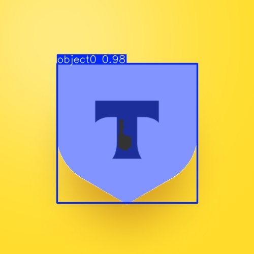
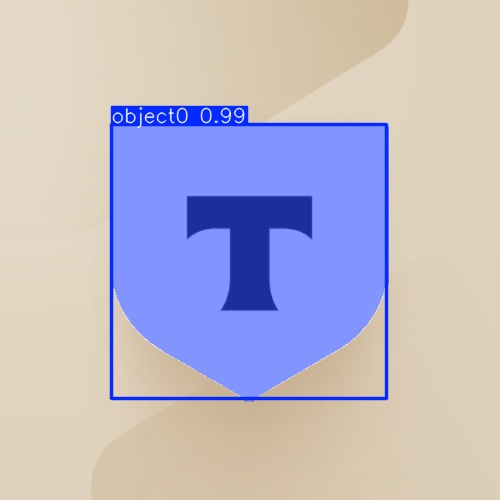
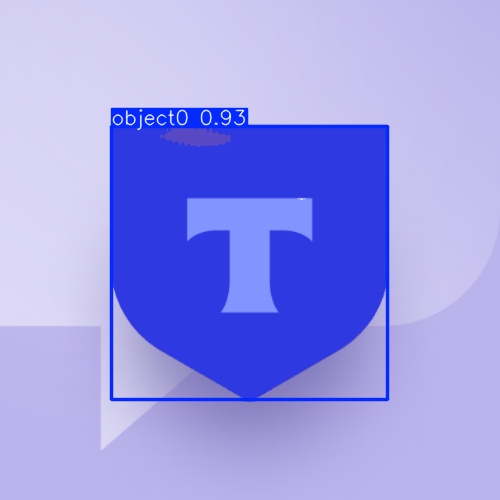

# YOLOE Docker Setup

## Обзор

Используйте Docker контейнер для запуска YOLOE - модели для автоматической разметки логотипов Т-Банка. 

Мой Docker-образ основан на `ultralytics/ultralytics:latest` с предустановленными зависимостями `Ultralytics`.

### Примеры результатов

Ниже приведены примеры изображений с визуализацией найденных логотипов Т-Банка с помощью YOLOE:







## Требования

- Docker установлен.
- NVIDIA Docker для GPU.
- Данные в `data/data_sirius/images/` и `data/tbank_official_logos/`.

## Скачивание готового образа

Скачайте готовый образ из Docker Hub:

```
docker pull medphisiker/tbank-yoloe-ultralytics
```

## Запуск контейнера

Из корня проекта:

```
docker run -it --gpus all -v ./data:/data -v ./data_preparation/yoloe:/app medphisiker/tbank-yoloe-ultralytics python tbank_yoloe_bulk_inference.py
```

- Volume: `./data:/data` для подключения данных для обработки и сохранения результатов обработки.
- Volume: `./data_preparation/yoloe:/app` для подключения папки содержащей код ля работы `YOLOE`:
1. скрипт `tbank_yoloe_bulk_inference.py` для запуска обработки.
2. python package `yoloe_package` содержаший удобный интерфейс для использования `YOLOE` для few-shot разметки данных.
- Результаты в `data/yoloe_results/`.
3. в эту же папку будут сохраняться веса моделей `model_cache`, необходимые для работы пайплайна.

## Скрипт запуска

Используйте `tbank_yoloe_bulk_inference.py` с config.json для параметров (input_dir, refs_json, output_dir, subset, conf, iou, runs_dir, device).

Пример config.json (для Docker используй абсолютные пути):
```json
{
  "input_dir": "/data/data_sirius/images",
  "refs_images_json": "/data/tbank_official_logos/refs_ls_coco.json",
  "refs_images_dir": "/data/tbank_official_logos",
  "output_dir": "/data/yoloe_results",
  "subset": 10,
  "conf": 0.5,
  "iou": 0.7,
  "runs_dir": "runs/yoloe_predict",
  "device": "0",
  "weights_dir": "./ultralytics_weights",
  "batch_size": 1,
  "imgsz": 480,
  "half": true,
  "save_visualizations": true,
  "use_sahi": false,
  "sahi_slice_height": 512,
  "sahi_slice_width": 512,
  "sahi_overlap_height_ratio": 0.2,
  "sahi_overlap_width_ratio": 0.2
}
```

## Описание параметров config.json

Ниже приведено подробное описание всех параметров конфигурационного файла `config.json`:

- **`input_dir`** (string): Путь к директории с входными изображениями для обработки. Поддерживает рекурсивную структуру поддиректорий. В Docker используйте абсолютные пути (например, `/data/tbank_official_logos/images`), в локальной среде — относительные.

- **`refs_images_json`** (string): Путь к JSON файлу с референсными данными в формате COCO. Содержит аннотации (bbox) для референсных изображений логотипов Т-Банка, используемых как визуальные промпты для модели YOLOE.

- **`refs_images_dir`** (string): Путь к директории с референсными изображениями. Используется для загрузки изображений, соответствующих аннотациям из `refs_images_json`.

- **`output_dir`** (string): Путь к директории для сохранения результатов обработки. Будут созданы поддиректории `pseudo_coco.json` и `annotated_images` с результатами.

- **`subset`** (null или integer): Количество изображений для обработки. `null` — обработать все изображения в `input_dir`. Число (например, 10) — обработать только первые N изображений, скопированные в поддиректорию 'subset'.

- **`conf`** (float): Порог уверенности для предсказаний модели (от 0.0 до 1.0). Значение по умолчанию: 0.5. Более высокие значения уменьшают количество ложных срабатываний, но могут пропустить некоторые логотипы.

- **`iou`** (float): Порог IoU (Intersection over Union) для NMS (Non-Maximum Suppression) (от 0.0 до 1.0). Значение по умолчанию: 0.7. Определяет, насколько пересекающиеся bounding box'ы считаются одним объектом.

- **`runs_dir`** (string): Путь к директории для сохранения промежуточных результатов прогонов модели. Обычно `runs/yoloe_predict`. Содержит логи, текстовые файлы с предсказаниями и визуализации.

- **`device`** (string): Устройство для выполнения инференса. `"0"` — GPU 0, `"cpu"` — CPU, `"auto"` — автоматический выбор. Рекомендуется `"0"` в Docker с `--gpus all`, `"cpu"` для CPU.

- **`weights_dir`** (string): Путь к директории для хранения весов модели YOLOE. По умолчанию `./ultralytics_weights`. **Примечание**: Из-за бага в ultralytics, веса могут скачиваться в `/app` (в Docker-контейнере), независимо от указанного пути. В локальной среде — в рабочую директорию.

- **`batch_size`** (integer): Размер батча для обработки изображений. По умолчанию `1`. Уменьшите значение при нехватке памяти GPU (например, установите `1` для GPU с 6GB памяти).

- **`imgsz`** (integer): Размер входного изображения для модели. По умолчанию `640`. Уменьшите для снижения потребления памяти (например, `480` или `320`).

- **`half`** (boolean): Включить FP16 (половинную точность) для снижения потребления памяти. По умолчанию `false`. Установите `true` для GPU с поддержкой FP16.

- **`save_visualizations`** (boolean): Сохранять ли визуализации предсказаний модели в виде изображений. По умолчанию `true`. Если `false`, будут сохранены только текстовые файлы с предсказаниями (labels), но не изображения с нарисованными bounding box'ами.

- **`use_sahi`** (boolean): Использовать ли SAHI для tiled inference на больших изображениях. По умолчанию `false`. Если `true`, изображения будут разбиваться на тайлы для более эффективной обработки больших изображений. **Примечание**: Требует установки SAHI (`pip install sahi`). Если SAHI не установлен, скрипт выдаст предупреждение и автоматически переключится на стандартный режим.

- **`sahi_slice_height`** (integer): Высота тайла для SAHI tiled inference. По умолчанию `512`. Используется только при `use_sahi: true`.

- **`sahi_slice_width`** (integer): Ширина тайла для SAHI tiled inference. По умолчанию `512`. Используется только при `use_sahi: true`.

- **`sahi_overlap_height_ratio`** (float): Коэффициент перекрытия тайлов по высоте для SAHI. По умолчанию `0.2` (20% перекрытие). Используется только при `use_sahi: true`.

- **`sahi_overlap_width_ratio`** (float): Коэффициент перекрытия тайлов по ширине для SAHI. По умолчанию `0.2` (20% перекрытие). Используется только при `use_sahi: true`.

**Примечание по weights_dir**: Из-за бага в ultralytics, веса моделей скачиваются в /app (в Docker-контейнере), независимо от указанного weights_dir. В локальной среде — в рабочую директорию (data_preparation/yoloe). При монтировании -v ./data_preparation/yoloe:/app веса сохраняются локально в data_preparation/yoloe.

**device**: "0" для GPU 0 (рекомендуется в Docker с --gpus all), "cpu" для CPU. "auto" может не работать — используйте явный номер GPU или "cpu".

**subset**: null для полного датасета или число (e.g. 10) для подмножества первых N изображений (копируются в поддиректорию 'subset' внутри input_dir).

## Новые скрипты для генерации данных

### Обзор пайплайна

Для улучшения качества обнаружения логотипов T-Bank реализован 3-шаговый пайплайн генерации данных:

1. **Обнаружение всех объектов** по текстовым промптам
2. **Извлечение кропов логотипов T-Bank** с ранжированием по уверенности
3. **Извлечение фоновых объектов** (non-overlapping с логотипами)

### Шаг 1: text_prompt_detection.py

Скрипт для обнаружения всех объектов на изображениях с помощью текстовых промптов YOLOE.

```bash
python text_prompt_detection.py
```

**Что делает:**
- Использует YOLOE с текстовыми промптами: "logo", "brand logo", "shield", "emblem", "text logo" и др.
- Обрабатывает все изображения из `input_dir`
- Сохраняет результаты в `text_prompt_detections.json` с уверенностью модели
- Низкий порог уверенности (0.18) для обнаружения максимального количества объектов

### Шаг 2: extract_tbank_crops.py

Скрипт для извлечения кропов логотипов T-Bank из результатов bulk inference.

```bash
python extract_tbank_crops.py
```

**Что делает:**
- Читает результаты из `runs/yoloe_predict/predict*/labels/`
- Извлекает кропы из аннотированных изображений
- Сортирует кропы по убыванию уверенности модели
- Сохраняет в папку `tbank_crops/` с именами вида `crop_000_s0.950.png`

### Шаг 3: extract_background_objects.py

Скрипт для извлечения фоновых объектов, не пересекающихся с логотипами T-Bank.

```bash
python extract_background_objects.py
```

**Что делает:**
- Загружает результаты из `text_prompt_detections.json` (Шаг 1)
- Загружает T-Bank detections из `pseudo_coco.json`
- Находит объекты с IoU < 0.3 относительно логотипов T-Bank
- Фильтрует по площади (0.5% - 60% от изображения)
- Сортирует по уверенности и сохраняет кропы в `backgrounds_obj/`

### Полный пайплайн

```bash
# Шаг 1: Обнаружение всех объектов
python text_prompt_detection.py

# Шаг 2: Запуск bulk inference для T-Bank логотипов (существующий скрипт)
python tbank_yoloe_bulk_inference.py

# Шаг 3: Извлечение кропов T-Bank
python extract_tbank_crops.py

# Шаг 4: Извлечение фоновых объектов
python extract_background_objects.py
```

### Выходные файлы

- `text_prompt_detections.json` - все обнаруженные объекты с уверенностью
- `tbank_crops/` - кропы логотипов T-Bank, отсортированные по уверенности
- `backgrounds_obj/` - кропы фоновых объектов, отсортированные по уверенности

Эти данные могут использоваться для генерации синтетических изображений с hard negatives для улучшения модели обнаружения логотипов.

## Выходные файлы

- `data/yoloe_results/pseudo_coco.json`: Псевдо-аннотации в COCO формате.
- `data/yoloe_results/annotated_images/`: Изображения с визуализацией предсказаний (bbox и маски).

## Отладка

Интерактивно:
```
docker run -it --gpus all -v ./data:/data -v ./data_preparation/yoloe:/app medphisiker/tbank-yoloe-ultralytics /bin/bash
```
Затем внутри контейнера:
```
python tbank_yoloe_bulk_inference.py
```

## Сборка образа (альтернативный вариант)

Если вы хотите собрать образ самостоятельно, из корня проекта:

```
docker build -f data_preparation/yoloe/Dockerfile -t tbank-yoloe-ultralytics data_preparation/yoloe
```

Затем используйте `tbank-yoloe-ultralytics` вместо `medphisiker/tbank-yoloe-ultralytics` в командах выше.