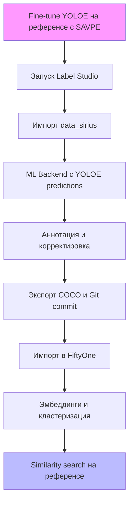

# Пайплайн аннотации логотипов Т-Банка: Label Studio + YOLOE + FiftyOne

> **Дата создания**: 16 сентября 2025  
> **Автор**: Sonoma (Kilo Code)  
> **Описание**: Руководство по организации полуавтоматической аннотации изображений из папки `data_sirius` для детекции логотипов Т-Банка. Интеграция Label Studio для аннотации с предсказаниями Ultralytics YOLOE (на базе YOLOv11), версионирование через Git, экспорт в FiftyOne для валидации и поиска похожих детекций на основе эмбеддингов. Основано на анализе `docs/3.data_preparation.md`, `fiftyone_similar_detections.py`, официальной документации Ultralytics YOLOE (https://docs.ultralytics.com/ru/models/yoloe/), Label Studio и FiftyOne (через Context7 и Tavily search).

Этот пайплайн минимизирует ручной труд, используя human-in-the-loop (предсказания YOLOE для начальной разметки на основе reference image) и автоматизированную валидацию в FiftyOne. Подходит для локальной разработки в проекте `d:/tinkoff/tbank_logo_detector`.

## Общая идея подхода

- **Цель**: Импортировать изображения из `data_sirius` в Label Studio, использовать YOLOE для предсказаний на основе референсного логотипа Т-Банка (one-shot detection через SAVPE — Semantic-Activated Visual Prompt Encoder), аннотировать/корректировать, версионировать аннотации, экспортировать в COCO-формат для FiftyOne. В FiftyOne вычислить эмбеддинги детекций (CLIP/DINOv3) и найти похожие на референс для валидации (как в разделе 5 `docs/3.data_preparation.md` и скрипте `fiftyone_similar_detections.py`).
- **Преимущества**:
  - Автоматическая преданнотация YOLOE ускоряет процесс (zero-shot/one-shot real-time в LS, ~130 FPS на GPU).
  - Версионирование через экспорты в Git обеспечивает traceability (provenance).
  - FiftyOne для визуализации, кластеризации и similarity search (cosine > 0.65).
- **Ограничения**: YOLOE требует reference с bbox; для высокой точности — fine-tune (linear probing на 100+ примерах). Поддержка instance segmentation (masks), но не semantic seg.

## Ключевые компоненты

1. **Label Studio (v1.19+)**: Платформа для аннотации. Поддержка object detection (`<RectangleLabels>`), импорт/экспорт COCO/YOLO. ML Backend для YOLOE.
2. **Ultralytics YOLOE (на базе YOLOv11)**: Детектор для open-vocabulary/one-shot detection. SAVPE позволяет использовать reference image для визуальных промптов (bbox + cls на эталоне для поиска похожих логотипов). Zero-shot на предобученных весах (`yoloe-11l-seg.pt`), fine-tune для кастомизации.
3. **FiftyOne (v0.25+)**: Импорт COCO, эмбеддинги патчей (`compute_patch_embeddings`), similarity (`compute_similarity`).
4. **Docker**: Локальный запуск LS и ML Backend.
5. **Git**: Версионирование COCO-экспортов.
6. **Зависимости**:
   - `pip install label-studio ultralytics fiftyone[all]`.
   - Модели: `yoloe-11l-seg.pt` (fine-tune до `tbank_yoloe.pt`), CLIP-ViT-B/32 или DINOv3.

## Workflow



## Детализированные шаги реализации

### 1. Подготовка YOLOE модели
YOLOE поддерживает zero-shot/one-shot detection: укажите reference image с bbox вокруг логотипа Т-Банка — модель найдет похожие экземпляры в data_sirius без обучения (SAVPE извлекает семантические признаки). Для лучшей точности — fine-tune (linear probing: заморозка backbone, дообучение head).

- **Zero-shot setup**: Используйте предобученные веса для визуальных промптов.
- Создайте датасет для fine-tune (если нужно): 50-100 примеров (референс + синтетика из раздела 6 `docs/3.data_preparation.md`).
- `dataset.yaml`:
  ```
  path: /path/to/dataset
  train: images/train
  val: images/val
  nc: 1
  names: ['tbank_logo']
  ```
- **Inference пример (zero-shot с reference, Ultralytics docs)**:
  ```python
  from ultralytics import YOLOE
  import numpy as np

  model = YOLOE("yoloe-11l-seg.pt")  # Large для точности

  # Visual prompts для reference
  visual_prompts = dict(
      bboxes=np.array([[100, 50, 300, 200]]),  # Bbox логотипа на ref (пиксели)
      cls=np.array([0])  # Класс ID
  )

  # Предварительная разметка data_sirius
  results = model.predict(
      source="data_sirius/",  # Папка изображений
      refer_image="reference_tbank_logo.jpg",
      visual_prompts=visual_prompts,
      imgsz=640,
      conf=0.5,  # Порог для логотипов
      iou=0.7,
      save=True  # Сохранит bbox/masks в runs/detect/
  )

  # Экспорт: results в COCO/YOLO для LS/FiftyOne
  for r in results:
      print(f"Детекций: {len(r.boxes)}, Masks: {r.masks is not None}")
      r.show()  # Визуализация
  ```
- **Fine-tune (Ultralytics docs)**:
  ```bash
  yolo detect train data=dataset.yaml model=yoloe-11l-seg.pt epochs=80 imgsz=640 freeze=[0,1,2]  # Linear probing
  ```
- Сохраните `best.pt` как `models/tbank_yoloe.pt`. Точность: ~52.6% mAP zero-shot, +3-5% после fine-tune.

### 2. Запуск Label Studio локально
- Docker (рекомендуется):
  ```bash
  docker run -it -p 8080:8080 -v ${PWD}/data_sirius:/label-studio/data/media heartexlabs/label-studio:latest
  ```
- Или pip: `pip install label-studio && label-studio start`.
- Доступ: http://localhost:8080. Создайте проект, сгенерируйте API-ключ (Settings > API Key).

### 3. Создание проекта и импорт данных
- В UI: New Project > Object Detection (или Segmentation для masks).
- Labeling config (`config.xml`):
  ```xml
  <View>
    <Image name="image" value="$image"/>
    <RectangleLabels name="label" toName="image" model_score_threshold="0.25" opacity="0.1">
      <Label value="tbank_logo" background="green"/>
    </RectangleLabels>
    <!-- Для seg: <BrushLabels name="mask" toName="image"> -->
  </View>
  ```
- Импорт: Import > Local Storage > Mount `data_sirius`. Все изображения станут задачами.

### 4. Интеграция YOLOE ML Backend
- Клонируйте: `git clone https://github.com/HumanSignal/label-studio-ml-backend.git && cd examples/yolo` (адаптируйте для YOLOE).
- Установите: `pip install -U ultralytics && pip install -r requirements.txt`.
- **Кастомный backend для YOLOE (yoloe_backend.py)**:
  ```python
  from label_studio_ml.model import LabelStudioMLBase
  from ultralytics import YOLOE
  import numpy as np
  from PIL import Image
  import requests  # Для загрузки изображений

  class YOLOEBBackend(LabelStudioMLBase):
      def __init__(self, **kwargs):
          super().__init__(**kwargs)
          self.model = YOLOE("yoloe-11l-seg.pt")  # Или tbank_yoloe.pt
          self.classes = ['tbank_logo']
          self.refer_image = "reference_tbank_logo.jpg"  # Fixed или из config
          self.visual_prompts = dict(
              bboxes=np.array([[100, 50, 300, 200]]),  # Bbox на ref
              cls=np.array([0])
          )

      def predict(self, tasks, **kwargs):
          predictions = []
          for task in tasks:
              img_url = task['data']['image']
              img_path = self.download_task_data(task, 'image')  # Локальный путь

              results = self.model.predict(
                  source=img_path,
                  refer_image=self.refer_image,
                  visual_prompts=self.visual_prompts,
                  conf=0.5,
                  iou=0.7,
                  save=False
              )

              ls_preds = []
              for r in results:
                  if r.boxes is not None:
                      for box in r.boxes:
                          x1, y1, x2, y2 = box.xyxy[0].tolist()
                          conf = box.conf[0].item()
                          # Нормализация для LS (%)
                          orig_w, orig_h = r.orig_shape[1], r.orig_shape[0]
                          ls_preds.append({
                              'from_name': 'label',
                              'to_name': 'image',
                              'type': 'rectanglelabels',
                              'value': {
                                  'x': (x1 / orig_w) * 100,
                                  'y': (y1 / orig_h) * 100,
                                  'width': ((x2 - x1) / orig_w) * 100,
                                  'height': ((y2 - y1) / orig_h) * 100,
                                  'rectanglelabels': [self.classes[0]],
                              },
                              'score': conf
                          })
                          # Для masks: конверт в polygons/RLE (pycocotools)

              predictions.append({'result': ls_preds, 'score': 0.9})
          return predictions

  # Запуск: label-studio-ml start yoloe_backend.py --script yoloe_backend:YOLOEBBackend --port 9090
  ```
- `docker-compose.yml` (как ранее, volumes для models/reference).
- Запуск: `docker-compose up`. Проверьте: `curl http://localhost:9090/`.
- В LS: Settings > ML > Add > URL: http://localhost:9090, Title: YOLOE T-Bank.

### 5. Аннотация
- Annotate: YOLOE предложит bbox/masks на основе reference (confidence > 0.25). Корректируйте (heuristics: IoU > 0.5 из `docs/3.data_preparation.md`).
- Human-in-the-loop: Принимайте/отвергайте, добавляйте метки. Для seg — используйте BrushLabels.

### 6. Версионирование
- Экспорт: UI > Export > COCO (включая изображения/masks).
- API:
  ```bash
  curl -X GET "http://localhost:8080/api/projects/{id}/export?exportType=COCO&download_all_tasks=true" -H "Authorization: Token {key}" -o v1_coco.json
  ```
- Git: `mkdir annotations && cd annotations && git init && git add v1_coco.json ../data_sirius/ && git commit -m "v1: YOLOE annotations"`.
- Автоматизация: Python SDK (`pip install label-studio-sdk`).

### 7. Экспорт в FiftyOne
- `exported/` с COCO JSON + изображения (bbox/segmentation).
- Импорт:
  ```python
  import fiftyone as fo
  dataset = fo.Dataset.from_dir(
      dataset_dir="exported",
      dataset_type=fo.types.COCODetectionDataset,  # Поддержка seg
      name="tbank_dataset"
  )
  session = fo.launch_app(dataset)
  ```

### 8. Эмбеддинги и кластеризация
- YOLOE predictions: Уже в датасете или добавьте.
- Эмбеддинги (как в `fiftyone_similar_detections.py`):
  ```python
  import fiftyone.zoo as foz
  model = foz.load_zoo_model("clip-vit-base32-torch")
  dataset.compute_patch_embeddings(model, patches_field="detections", embeddings_field="emb")
  ```
- Кластеризация: `import fiftyone.brain as fob; fob.compute_visualization(dataset, "detections", num_clusters=10)`.

### 9. Поиск похожих
- Референс эмбеддинг: `query_emb = model.embed(Image.open("ref.jpg"))`.
- Search:
  ```python
  view = dataset.compute_similarity("emb", query_emb, threshold=0.65, brain_key="sim_index")
  fo.launch_app(view)
  ```
- Расширьте `fiftyone_similar_detections.py` для YOLOE results (интеграция с masks).

## Рекомендации
- **Zero-shot vs Fine-tune**: Начните с zero-shot (SAVPE на reference) для прототипа; fine-tune если mAP < 80% на val (LVIS-like для логотипов).
- **Тестирование**: 100 изображений из `data_sirius`. Оцените precision/recall на золотом сете (раздел 5 `docs/3.data_preparation.md`).
- **Масштаб**: Для >10k — distributed inference (YOLOE на multiple GPUs).
- **Улучшения**: Интегрируйте SAM для refinement масок. Hard-negatives (Tinkoff) — фильтр по эмбеддингам.
- **Ошибки**: Low conf — настройте visual_prompts bbox; для seg — конверт masks в COCO RLE.

## Ссылки
- Ultralytics YOLOE: [Docs](https://docs.ultralytics.com/ru/models/yoloe/) (SAVPE, one-shot).
- Label Studio: [YOLO Integration](https://labelstud.io/integrations/machine-learning/yolo) (адаптировать для YOLOE).
- FiftyOne: [Import COCO](https://docs.voxel51.com/user_guide/import_export.html), [Brain](https://docs.voxel51.com/user_guide/brain.html).
- Context7: `/humansignal/label-studio`, `/voxel51/fiftyone`.
- Tavily: "YOLOE reference image detection".

Для runnable notebook в `annotation/` — дайте знать.