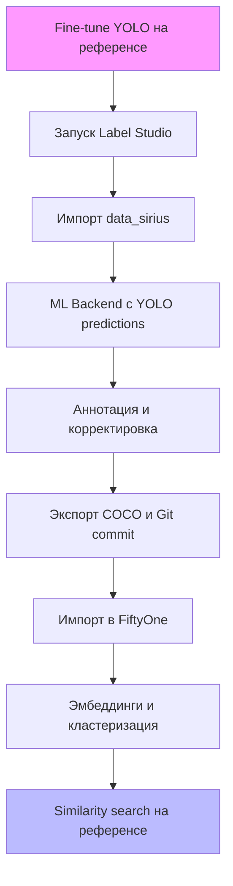

# Пайплайн аннотации логотипов Т-Банка: Label Studio + YOLO + FiftyOne

> **Дата создания**: 16 сентября 2025  
> **Автор**: Sonoma (Kilo Code)  
> **Описание**: Руководство по организации полуавтоматической аннотации изображений из папки `data_sirius` для детекции логотипов Т-Банка. Интеграция Label Studio для аннотации с предсказаниями Ultralytics YOLO, версионирование через Git, экспорт в FiftyOne для валидации и поиска похожих детекций на основе эмбеддингов. Основано на анализе `docs/3.data_preparation.md`, `fiftyone_similar_detections.py`, официальной документации Label Studio, Ultralytics и FiftyOne (через Context7 и Tavily search).

Этот пайплайн минимизирует ручной труд, используя human-in-the-loop (предсказания YOLO для начальной разметки) и автоматизированную валидацию в FiftyOne. Подходит для локальной разработки в проекте `d:/tinkoff/tbank_logo_detector`.

## Общая идея подхода

- **Цель**: Импортировать изображения из `data_sirius` в Label Studio, использовать YOLO для предсказаний на основе референсного логотипа Т-Банка, аннотировать/корректировать, версионировать аннотации, экспортировать в COCO-формат для FiftyOne. В FiftyOne вычислить эмбеддинги детекций (CLIP/DINOv3) и найти похожие на референс для валидации (как в разделе 5 `docs/3.data_preparation.md` и скрипте `fiftyone_similar_detections.py`).
- **Преимущества**:
  - Автоматическая преданнотация YOLO ускоряет процесс (real-time в LS).
  - Версионирование через экспорты в Git обеспечивает traceability (provenance).
  - FiftyOne для визуализации, кластеризации и similarity search (cosine > 0.65).
- **Ограничения**: YOLO требует fine-tune на референсе; Label Studio open-source не имеет встроенного версионирования проектов (используйте экспорты).

## Ключевые компоненты

1. **Label Studio (v1.19+)**: Платформа для аннотации. Поддержка object detection (`<RectangleLabels>`), импорт/экспорт COCO/YOLO. ML Backend для YOLO.
2. **Ultralytics YOLOv8/YOLO11**: Детектор. Fine-tune на референсе для класса "tbank_logo".
3. **FiftyOne (v0.25+)**: Импорт COCO, эмбеддинги патчей (`compute_patch_embeddings`), similarity (`compute_similarity`).
4. **Docker**: Локальный запуск LS и ML Backend.
5. **Git**: Версионирование COCO-экспортов.
6. **Зависимости**:
   - `pip install label-studio ultralytics fiftyone[all]`.
   - Модели: `yolov8n.pt` (fine-tune до `tbank_logo.pt`), CLIP-ViT-B/32 или DINOv3.

## Workflow



## Детализированные шаги реализации

### 1. Подготовка YOLO модели
- Создайте датасет для fine-tune: 50-100 примеров логотипа (референс + синтетика из раздела 6 `docs/3.data_preparation.md`: рендер с alpha-blending на фоны).
- `dataset.yaml`:
  ```
  path: /path/to/dataset
  train: images/train
  val: images/val
  nc: 1
  names: ['tbank_logo']
  ```
- Fine-tune (Ultralytics docs):
  ```bash
  yolo detect train data=dataset.yaml model=yolov8n.pt epochs=50 imgsz=640
  ```
- Сохраните `runs/detect/train/weights/best.pt` как `models/tbank_logo.pt`.

### 2. Запуск Label Studio локально
- Docker (рекомендуется):
  ```bash
  docker run -it -p 8080:8080 -v ${PWD}/data_sirius:/label-studio/data/media heartexlabs/label-studio:latest
  ```
- Или pip: `pip install label-studio && label-studio start`.
- Доступ: http://localhost:8080. Создайте проект, сгенерируйте API-ключ (Settings > API Key).

### 3. Создание проекта и импорт данных
- В UI: New Project > Object Detection.
- Labeling config (`config.xml`):
  ```xml
  <View>
    <Image name="image" value="$image"/>
    <RectangleLabels name="label" toName="image" model_score_threshold="0.25" opacity="0.1">
      <Label value="tbank_logo" background="green"/>
    </RectangleLabels>
  </View>
  ```
- Импорт: Import > Local Storage > Mount `data_sirius`. Все изображения станут задачами.

### 4. Интеграция YOLO ML Backend
- Клонируйте: `git clone https://github.com/HumanSignal/label-studio-ml-backend.git && cd examples/yolo`.
- Установите: `pip install -U ultralytics && pip install -r requirements.txt`.
- `docker-compose.yml`:
  ```yaml
  services:
    yolo:
      image: labelstudio/ml-backend
      ports: ["9090:9090"]
      volumes: ["./models:/app/models"]  # tbank_logo.pt здесь
      environment:
        - ALLOW_CUSTOM_MODEL_PATH=true
        - LABEL_STUDIO_URL=http://host.docker.internal:8080
        - LABEL_STUDIO_API_KEY=your_api_key
  ```
- Запуск: `docker-compose up`. Проверьте: `curl http://localhost:9090/`.
- В LS: Settings > ML > Add > URL: http://localhost:9090, Title: YOLO T-Bank.

### 5. Аннотация
- Annotate: YOLO предложит bbox (confidence > 0.25). Корректируйте (heuristics: IoU > 0.5 из `docs/3.data_preparation.md`).
- Human-in-the-loop: Принимайте/отвергайте, добавляйте метки.

### 6. Версионирование
- Экспорт: UI > Export > COCO (включая изображения).
- API:
  ```bash
  curl -X GET "http://localhost:8080/api/projects/{id}/export?exportType=COCO&download_all_tasks=true" -H "Authorization: Token {key}" -o v1_coco.json
  ```
- Git: `mkdir annotations && cd annotations && git init && git add v1_coco.json ../data_sirius/ && git commit -m "v1: Initial"`.
- Автоматизация: Python SDK (`pip install label-studio-sdk`):
  ```python
  from label_studio_sdk import Client
  ls = Client(url='http://localhost:8080', api_key='key')
  project = ls.start_project(title='T-Bank', labeling_config=config_xml)
  # Импорт/экспорт по API
  ```

### 7. Экспорт в FiftyOne
- `exported/` с COCO JSON + изображения.
- Импорт:
  ```python
  import fiftyone as fo
  dataset = fo.Dataset.from_dir(
      dataset_dir="exported",
      dataset_type=fo.types.COCODetectionDataset,
      name="tbank_dataset"
  )
  session = fo.launch_app(dataset)
  ```

### 8. Эмбеддинги и кластеризация
- YOLO predictions (если нужно): `from ultralytics import YOLO; model.predict(dataset)`.
- Эмбеддинги (как в `fiftyone_similar_detections.py`):
  ```python
  import fiftyone.zoo as foz
  model = foz.load_zoo_model("clip-vit-base32-torch")
  dataset.compute_patch_embeddings(model, patches_field="detections", embeddings_field="emb")
  ```
- Кластеризация: `import fiftyone.brain as fob; fob.compute_visualization(dataset, "detections", num_clusters=10)`.

### 9. Поиск похожих
- Референс эмбеддинг: `query_emb = model.embed(fo.Image.open("ref.jpg"))`.
- Search:
  ```python
  view = dataset.compute_similarity("emb", query_emb, threshold=0.65, brain_key="sim_index")
  fo.launch_app(view)
  ```
- Расширьте `fiftyone_similar_detections.py` для индекса (LanceDB/Milvus для scale).

## Рекомендации
- **Тестирование**: 100 изображений из `data_sirius`. Оцените precision/recall на золотом сете (500 примеров, раздел 5 `docs/3.data_preparation.md`).
- **Масштаб**: Для >10k изображений — LS Enterprise или distributed FO.
- **Улучшения**: Добавьте SAM для масок (`docs/3.data_preparation.md`). Hard-negatives (Tinkoff) — фильтр по эмбеддингам.
- **Ошибки**: Если YOLO low confidence — увеличьте epochs или добавьте аугментации.

## Ссылки
- Label Studio: [YOLO Integration](https://labelstud.io/integrations/machine-learning/yolo), [Export](https://labelstud.io/guide/export).
- Ultralytics: [Detect Train](https://docs.ultralytics.com/tasks/detect).
- FiftyOne: [Import COCO](https://docs.voxel51.com/user_guide/import_export.html), [Brain](https://docs.voxel51.com/user_guide/brain.html).
- Context7: `/humansignal/label-studio` (ML Backend), `/voxel51/fiftyone` (embeddings).
- Tavily: Поиск по "YOLO Label Studio integration" (labelstud.io/blog).

Для runnable notebook в `annotation/` — дайте знать.