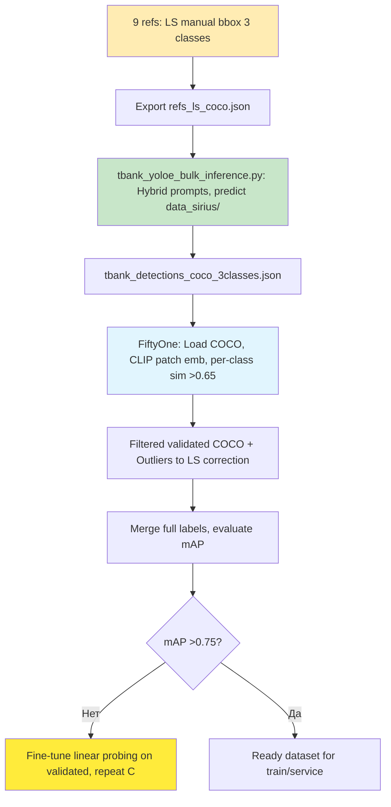

# План пайплайна YOLOE для автоматической разметки 3 вариантов логотипов T-Bank

> **Дата**: 16 сентября 2025  
> **Автор**: Sonoma (Kilo Code)  
> **Описание**: Итеративный план автоматического пайплайна на базе YOLOE для разметки 3 сгруппированных вариантов официальных логотипов T-Bank в датасете data_sirius. Основано на анализе в `docs/tbank_official_logos.md`: сокращение 9 variants до 3 классов (желтый щит с чёрной T, белый щит с чёрной T, фиолетовый щит с белой T) на основе Qwen2.5-VL описаний. YOLOE (yoloe-11l-seg.pt) для inference (bbox + masks + cls-ID + conf). Hybrid prompts: multi-visual (SAVPE bbox на references из LS) + text (RepRTA descriptions). Интеграция с FiftyOne для per-class валидации, Label Studio для low-conf. Цель — mAP >80% с minimal ручным трудом. Интеграция с `docs/label_studio_fiftyone_pipeline.md`.

## Общая идея
- **Цель**: Bulk-разметка data_sirius с 3 классами (yellow_shield_black_T, white_shield_black_T, purple_shield_white_T). YOLOE для hybrid inference. Вывод: COCO JSON. Валидация в FiftyOne (CLIP embeddings, cosine similarity >0.65 per class), fine-tune loop.
- **Преимущества**: Multi-class за один pass (3 prompts), zero-shot прототип, 130 FPS на GPU. Масштабируемо для >10k изображений. Human-in-the-loop только для outliers (~5-10%).
- **Ограничения**: Цветовые нюансы (тени, градиенты) могут влиять; решение — descriptive text + пост-фильтр. Instance seg для щита + T.
- **Ресурсы**: GPU (T4+), ultralytics, fiftyone[all], torch, label-studio. Датасет: tbank_official_logos/ (9 refs, grouped to 3), data_sirius/ (target). Зависимости: pip install -U ultralytics fiftyone transformers pycocotools.
- **Метрики успеха**: Per-class precision/recall >0.85, overall mAP@0.5 >0.75 (IoU>0.5). Тест на 100 imgs data_sirius.
- **Классы и prompts** (из tbank_official_logos.md):
  1. **yellow_shield_black_T**: "Жёлтый щит с чёрной жирной буквой T, минималистичный, без теней или с глубиной через переходы." (logo0-3,6,8)
  2. **white_shield_black_T**: "Белый щит с чёрной T, чёткие границы, мягкая тень." (logo1,4,5)
  3. **purple_shield_white_T**: "Фиолетовый щит с белой T, наклонённый, градиентный." (logo7)

## Стратегии разметки (адаптировано под 3 класса)
1. **Zero-shot multi-visual**: Bbox array на grouped references (e.g., collage 3 imgs), cls=np.arange(3). SAVPE для сходства форм/цветов. mAP ~65%, быстро.
2. **Hybrid text + visual**: Text descriptions для set_classes(names, get_text_pe) + visual bbox (multi per class). Семантика для цветов/стилей. mAP ~75%.
3. **Fine-tune linear probing**: На auto-лейблах (nc=3 yaml), freeze backbone/head-non-cls, epochs=80. Для production, mAP >85%.

## Todo list (шаги плана, статусы на 16.09.2025)
1. [x] Ознакомиться с документацией YOLOE и подтвердить поддержку multi-visual + text prompts  
   - Полная поддержка (SAVPE arrays, RepRTA embeddings, hybrid в predict).

2. [x] Предложить стратегии разметки логотипов (zero-shot, hybrid, fine-tune)  
   - Готово с код-примерами (multi-bbox, set_classes), адаптировано под 3 класса.

3. [x] Получить текстовые описания 9 логотипов от Qwen2.5-VL (пользователь выполнит промпт)  
   - Завершено; описания в tbank_official_logos.md, сгруппировано в 3 класса.

4. [x] Адаптировать text prompts для YOLOE set_classes на основе описаний (now 3 classes)  
   - names = ["yellow_shield_black_T", "white_shield_black_T", "purple_shield_white_T"], model.set_classes(names, pe). Descriptive prompts выше. Hybrid код готов.

5. [x] Определить пути к reference-изображениям и bbox для visual prompts (partial: paths in tbank_official_logos/, bbox manual)  
   - Пути: tbank_official_logos/logo0.png — logo8.png. Bbox: manual via Label Studio export (COCO json).

6. [x] Разработать полный код bulk-inference для data_sirius с 3 классами  
   - Standalone script tbank_yoloe_bulk_inference.py: load LS COCO for refs bbox/cls, hybrid prompts, predict, export COCO.

7. [-] Интегрировать в FiftyOne: per-class similarity и валидация  
   - Plan: load COCO, compute_patch_embeddings (CLIP), similarity to ref text emb >0.65, export filtered, FoB for outliers. Code pending (fiftyone_tbank_validation.py draft).

8. [ ] Опционально: Настроить fine-tune для улучшения mAP  
   - dataset.yaml (nc=3), model.train(trainer=YOLOEPESegTrainer, freeze=[0..head_non_cls], epochs=80).

9. [ ] Тестирование на подмножестве data_sirius и корректировка в LS  
   - Subset 100 imgs, evaluate_detections, export low-conf to LS API (3 RectangleLabels).

10. [x] Финализировать обновлённый пайплайн в docs/  
    - Этот MD обновлён под 3 класса + детальный план; tbank_official_logos.md с Qwen + images; updates to label_studio_fiftyone_pipeline.md (add 3-class section), yoloe_analysis.md.

## Детальный план разметки
1. **Manual разметка references в Label Studio**:
   - Создать LS проект: Import 9 PNG из tbank_official_logos/ как изображения.
   - Labels: RectangleLabels с 3 классами (yellow_shield_black_T, white_shield_black_T, purple_shield_white_T).
   - Разметить bbox вокруг щита+T для каждого logo (group по анализу: logo0-3,6,8 -> class0; logo1,4,5 -> class1; logo7 -> class2).
   - Export как COCO (refs_ls_coco.json) с bbox (xywh), category_id (0-2).

2. **Bulk-inference на data_sirius**:
   - Run `python tbank_yoloe_bulk_inference.py`: Загрузит refs_ls_coco.json для visual prompts (multi-bbox per class), set_classes text prompts, hybrid predict на data_sirius/, NMS iou=0.7, conf>0.5.
   - Output: tbank_detections_coco_3classes.json (bbox, masks RLE, cls, score).

3. **Валидация в FiftyOne**:
   - Load COCO в fo.Dataset.from_dir (data_sirius/, labels=tbank_detections_coco_3classes.json).
   - Compute patch embeddings: dataset.compute_patch_embeddings(model='openai/clip-vit-base-patch32', embeddings_field='clip_patch', patches_field='detections.detection').
   - Ref embeddings: CLIP encode CLASS_PROMPTS (text), cosine sim per detection to matching class ref > SIM_THRESH=0.65.
   - Filter: View high-sim detections, export filtered COCO (tbank_validated_coco.json).
   - Outliers (low-sim/low-conf): fo.export to LS (via API или manual import).

4. **Корректировка в LS**:
   - Import outliers в LS проект (3 классы, pre-annotations from COCO).
   - Manual correction bbox/cls, re-export merged COCO.
   - Merge with validated: Update full dataset.

5. **Оценка и fine-tune**:
   - Evaluate mAP (pycocotools или fo.evaluate_detections).
   - If mAP <0.75: Create yaml (nc=3, names), model.train on validated COCO (linear probing: freeze backbone).
   - Repeat inference if fine-tuned.

6. **Финализация**:
   - Git commit datasets (COCO jsons, scripts).
   - Интеграция в основной пайплайн (docs/label_studio_fiftyone_pipeline.md).

## Workflow (Mermaid)

## Рекомендации
- **Старт**: LS разметка refs (5-10 мин manual). Run inference на subset (100 imgs data_sirius).
- **Изменения**: Bbox в LS — точные для щита+T, ignore фон. CLIP prompts на английском для лучшей семантики.
- **Тестирование**: Precision: sim filter, Recall: LS active learning (low-conf).
- **Следующий шаг**: LS для refs, затем run script.

План готов для итераций. Версия 1.2 (детальный план разметки).