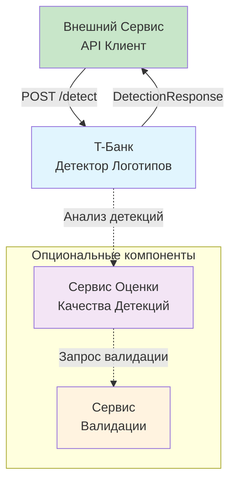
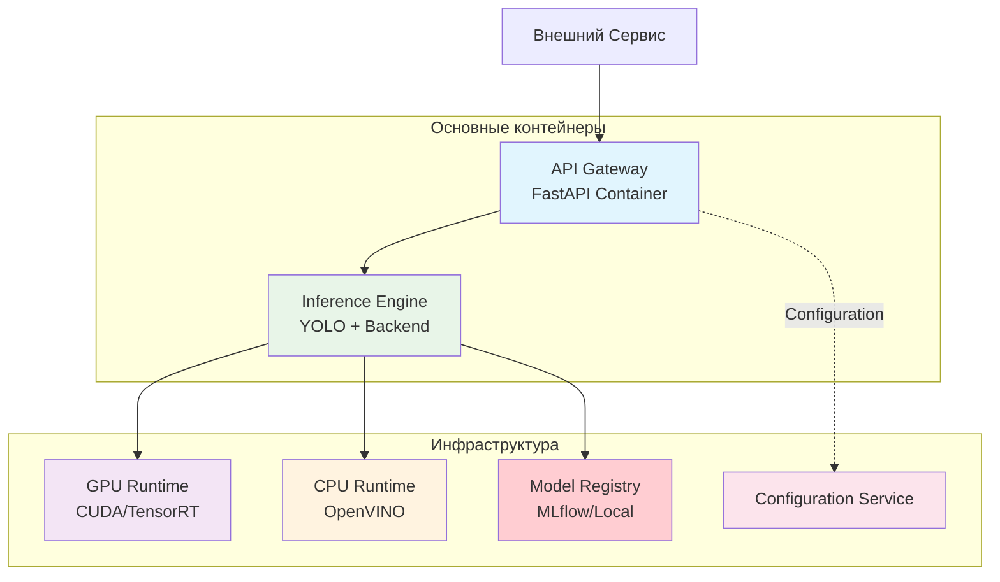
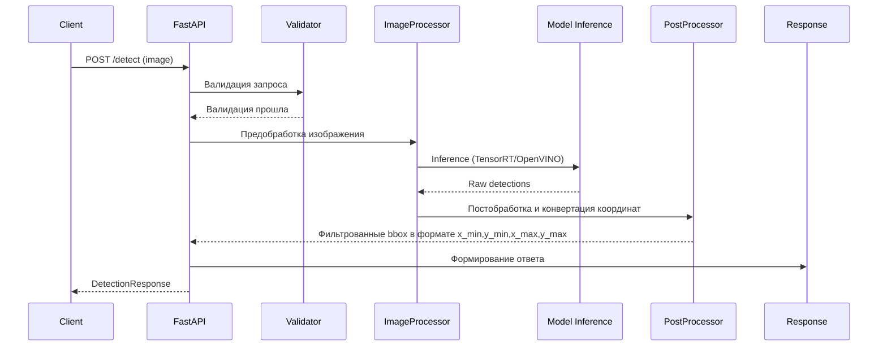

# Архитектура сервиса детекции логотипа Т-Банка

## Обзор

REST API сервис для детекции логотипа Т-Банка на изображениях с использованием предобученной модели YOLOv11. Сервис принимает изображения в форматах JPEG, PNG, BMP, WEBP и возвращает координаты найденных логотипов в формате, соответствующем техническому заданию.

## Основные требования

- **Порт:** 8000
- **Эндпоинт:** POST /detect
- **Время обработки:** ≤ 10 секунд на изображение
- **Поддержка GPU/CPU:** CUDA для GPU, OpenVINO для CPU
- **Форматы:** JPEG, PNG, BMP, WEBP
- **Модель:** YOLOv11 (Ultralytics) с поддержкой различных бэкендов

## Варианты архитектуры

### Вариант 1: Простой запуск с Ultralytics YOLO
Использование официальной библиотеки Ultralytics YOLO с поддержкой:
- **TensorRT** для GPU ускорения
- **OpenVINO** для CPU оптимизации
- Прямой запуск без дополнительных серверов

### Вариант 2: Продвинутый вариант с Triton Inference Server
Использование NVIDIA Triton для:
- Производственного масштабирования
- Автоматического батчинга
- Поддержки множества форматов моделей
- Встроенного мониторинга

## Архитектура компонентов

### Основные компоненты системы:

1. **T-Банк Детектор Логотипов** - Основной сервис детекции
2. **Сервис Оценки Отправления на Валидацию** (опционально) - Анализ качества детекций
3. **Сервис Валидации** (опционально) - Дополнительная проверка сложных случаев

### Поток данных:

1. Внешний сервис отправляет запрос на детекцию
2. Детектор выполняет inference и возвращает результаты
3. При необходимости детекции отправляются в сервис оценки
4. Сервис оценки может запросить дополнительную валидацию

## C4 Диаграммы архитектуры

### C4 Level 1: System Context (Контекст системы)



**Описание:** Основной сервис детекции принимает запросы и возвращает результаты. Опциональные сервисы оценки и валидации могут использоваться для анализа качества детекций и обработки сложных случаев.

### C4 Level 2: Container Diagram (Контейнеры)



**Контейнеры:**
- **API Gateway** - FastAPI приложение для обработки HTTP запросов
- **Inference Engine** - Контейнер с YOLO моделью и выбранным бэкендом
- **GPU Runtime** - CUDA/TensorRT для GPU ускорения
- **CPU Runtime** - OpenVINO для CPU оптимизации
- **Model Registry** - Хранилище версий моделей (MLflow или локальное)
- **Configuration Service** - Управление конфигурацией

## Model Registry (Хранилище моделей)

### Простой вариант: Локальное хранилище
- Монтирование папки с PyTorch моделями в Docker контейнер
- Хранение только исходных .pt файлов моделей
- Версионирование через имена папок
- Легкое управление через файловую систему

**Структура локального реестра:**
```
model_registry/
├── tbank_detector/
│   ├── v1/
│   │   ├── model.pt              # Исходная PyTorch модель
│   │   ├── metadata.json         # Метаданные модели
│   │   └── training_report.pdf    # Отчет по обучению
│   ├── v2/
│   │   ├── model.pt              # Улучшенная версия
│   │   ├── metadata.json
│   │   └── training_report.pdf
│   └── current -> v2             # Текущая версия
```

### Продвинутый вариант: MLflow Model Registry
- Централизованное управление версиями PyTorch моделей
- Автоматическое трекинг экспериментов обучения
- REST API для управления моделями
- Поддержка staging/production окружений

### Процесс оптимизации моделей при запуске:
1. **Загрузка PyTorch модели** из реестра
2. **Конвертация в целевой формат** под текущее окружение:
   - TensorRT для GPU (оптимизация под конкретную CUDA версию)
   - OpenVINO для CPU (оптимизация под конкретный процессор)
3. **Кэширование оптимизированных моделей** для последующих запусков
4. **Использование оптимизированной версии** для inference

**Преимущества подхода:**
- Единый источник истины - только PyTorch модели
- Автоматическая адаптация под железо пользователя
- Оптимальная производительность для каждого окружения
- Упрощенное управление версиями

## Поддерживаемые бэкенды с автоматической оптимизацией

### 1. TensorRT для GPU (Автоматическая конвертация)
- Конвертация PyTorch → TensorRT при запуске
- Оптимизация под конкретную версию CUDA
- Поддержка FP16/INT8 квантования
- Кэширование скомпилированных моделей

### 2. OpenVINO для CPU (Автоматическая конвертация)
- Конвертация PyTorch → OpenVINO при запуске
- Оптимизация под конкретный процессор
- Хорошая производительность без GPU
- Автоматическое определение capabilities CPU

### 3. Прямой PyTorch (Без конвертации)
- Использование исходной .pt модели
- Подходит для разработки и тестирования
- Минимальные требования к зависимостям

### 4. Triton Inference Server (Продвинутый вариант)
- Производственное масштабирование
- Автоматическое батчинг
- Мульти-модельная поддержка
- Конвертация моделей в фоновом режиме

## Компоненты системы:

### 1. Внешний Сервис API Клиент
- **Роль:** Инициатор процесса детекции
- **Интерфейс:** REST API с multipart/form-data

### 2. T-Банк Детектор Логотипов
- **Роль:** Основной сервис детекции
- **Технологии:** YOLOv11 с поддержкой TensorRT/OpenVINO
- **Производительность:** ≤ 10 секунд на изображение

### 3. Сервис Оценки Качества Детекций (Опционально)
- **Назначение:** Анализ уверенности предсказаний
- **Методы:** Novelty detection, confidence analysis
- **Использование:** Для сложных случаев и улучшения качества

### 4. Сервис Валидации (Опционально)
- **Назначение:** Дополнительная проверка
- **Методы:** Human-in-the-loop, ensemble models
- **Активация:** Только для выбранных случаев

## Взаимодействие компонентов

| Отправитель | Получатель | Тип взаимодействия | Описание |
|-------------|------------|-------------------|----------|
| Внешний Сервис | Детектор | HTTP POST /detect | Запрос на детекцию |
| Детектор | Внешний Сервис | HTTP 200 | Ответ с координатами |
| Детектор | Сервис Оценки | Async message | Анализ качества |
| Сервис Оценки | Сервис Валидации | Async message | Запрос валидации |

## API Контракт

### Request:
```
POST /detect
Content-Type: multipart/form-data

file: <image_file>
```

### Response (Соответствует ТЗ):
```json
{
  "detections": [
    {
      "bbox": {
        "x_min": 100,
        "y_min": 200,
        "x_max": 300,
        "y_max": 400
      },
      "confidence": 0.95,
      "class": "tbank_logo"
    }
  ]
}
```

### Error Response:
```json
{
  "error": "Invalid image format",
  "detail": "Supported formats: JPEG, PNG, BMP, WEBP"
}
```

## Процесс работы

### Последовательность обработки запроса



## Преимущества архитектуры

### Для учебного проекта (Рекомендуется):
- **Простота:** Минимальная сложность развертывания
- **Гибкость:** Легкая смена моделей и бэкендов
- **Производительность:** Оптимизация под доступное железо
- **Соответствие ТЗ:** Полное соответствие API контракту

### Для production (Опционально):
- **Масштабируемость:** Triton для высоких нагрузок
- **Мониторинг:** Встроенные метрики и health checks
- **Надежность:** Обработка ошибок, retry логика

## Docker конфигурация

### Вариант 1: Простой запуск с локальным Model Registry
```dockerfile
FROM ultralytics/ultralytics:latest

WORKDIR /app
COPY requirements.txt .
RUN pip install -r requirements.txt

COPY src/ ./src/
COPY model_registry/ ./model_registry/

# Монтируем Model Registry как volume
VOLUME /app/model_registry

CMD ["uvicorn", "src.main:app", "--host", "0.0.0.0", "--port", "8000"]
```

### Вариант 2: С MLflow Model Registry
```dockerfile
FROM ultralytics/ultralytics:latest

WORKDIR /app
COPY requirements.txt .
RUN pip install -r requirements.txt mlflow

COPY src/ ./src/

# Используем MLflow для управления моделями
CMD ["uvicorn", "src.main:app", "--host", "0.0.0.0", "--port", "8000"]
```

### Вариант 3: Triton Inference Server с Registry
```dockerfile
FROM nvcr.io/nvidia/tritonserver:24.09-py3

# Копируем Model Registry для Triton
COPY model_registry/ /models/

CMD ["tritonserver", "--model-repository=/models"]
```

## Управление моделями через Model Registry

### Оптимизация только при смене модели:
Конвертация моделей в оптимальные форматы выполняется **только при изменении версии модели** или **смене аппаратного окружения**. Это позволяет избежать избыточных преобразований и экономит время запуска.

### Процесс загрузки с интеллектуальным кэшированием:
```python
def load_optimized_model(model_path, device="cuda"):
    """
    Загрузка модели с оптимизацией только при необходимости
    """
    # Проверяем хэш текущей модели и окружения
    model_hash = calculate_model_hash(model_path)
    env_hash = calculate_environment_hash(device)
    
    cache_key = f"{model_hash}_{env_hash}"
    cached_model = check_cache(cache_key)
    
    if cached_model:
        # Используем кэшированную оптимизированную модель
        return load_cached_model(cached_model)
    else:
        # Конвертируем и кэшируем новую модель
        pt_model = YOLO(model_path, task="detect")
        optimized_model = convert_model(pt_model, device)
        save_to_cache(optimized_model, cache_key)
        return optimized_model
```

### Условия для конвертации модели:
1. **Смена версии модели** в Model Registry
2. **Изменение аппаратного окружения** (GPU/CPU, версия CUDA)
3. **Первоначальный запуск** без кэшированных моделей
4. **Принудительная переконвертация** через конфигурацию

### Преимущества подхода:
- **Минимизация времени запуска** - конвертация только когда действительно нужно
- **Автоматическое определение** необходимости конвертации
- **Кэширование оптимизированных моделей** для повторного использования
- **Поддержание актуальности** с изменениями в Model Registry

### Обновление модели в Registry:
1. **Обучение новой версии** модели YOLOv11
2. **Сохранение как .pt файл** в Model Registry
3. **Добавление метаданных** и отчета по обучению
4. **Обновление симлинка** `current` на новую версию
5. **Автоматическая переконвертация** при следующем запуске

## Соответствие требованиям

| Требование | Реализация | Статус |
|------------|------------|--------|
| **Порт 8000** | FastAPI на порту 8000 | ✅ |
| **POST /detect** | Эндпоинт для загрузки изображений | ✅ |
| **Форматы изображений** | JPEG, PNG, BMP, WEBP | ✅ |
| **Время ≤ 10 сек** | GPU/CPU оптимизация | ✅ |
| **Формат координат** | x_min,y_min,x_max,y_max | ✅ |
| **Логотип Т-Банка** | Обученная модель YOLOv11 | ✅ |
| **Игнор Тинькофф** | Class-specific training | ✅ |
| **Docker контейнер** | Готовые образы с Model Registry | ✅ |
| **Управление версиями** | Model Registry с версионированием | ✅ |

## Заключение

Архитектура предоставляет гибкий выбор между простым решением для учебного проекта и продвинутым вариантом для production использования. Включение Model Registry обеспечивает профессиональное управление версиями обученных моделей YOLOv11.

**Ключевые преимущества:**
- Полное соответствие API контракту ТЗ
- Поддержка различных бэкендов (TensorRT/OpenVINO/Triton)
- Профессиональное управление версиями через Model Registry
- Простота смены моделей и конфигурации
- Оптимизация производительности под доступное железо
- Четкое разделение ответственности компонентов
- Использование самостоятельно обученной модели YOLOv11