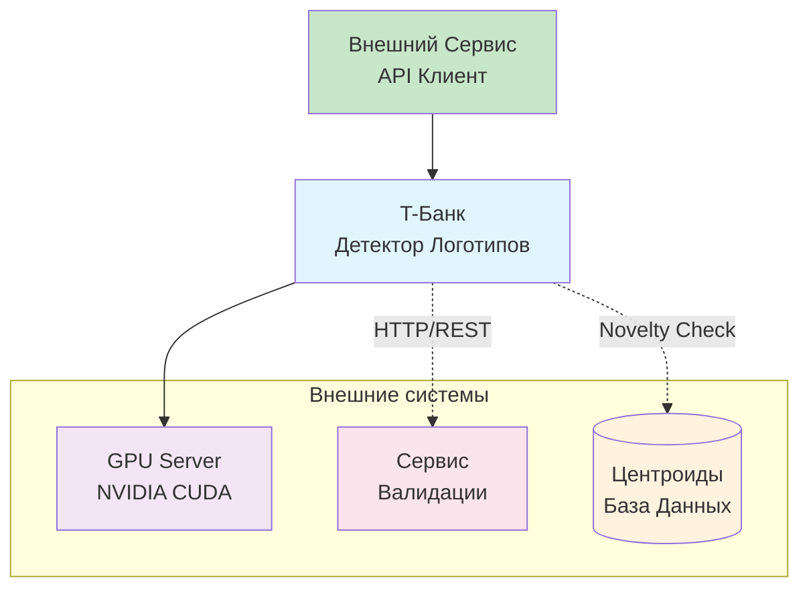
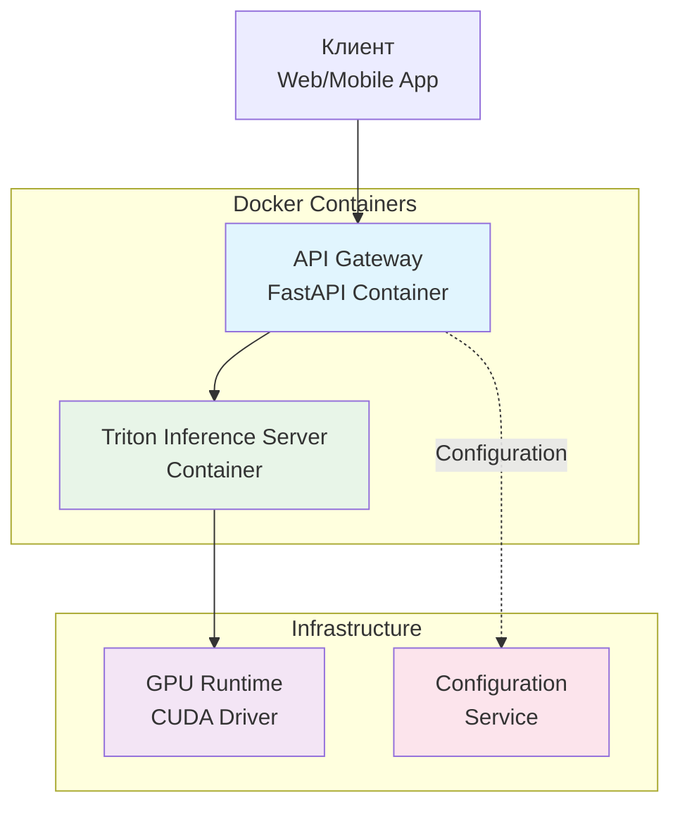
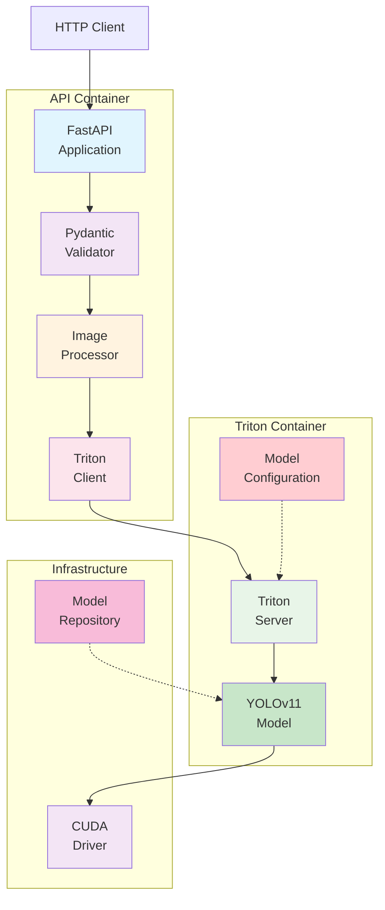
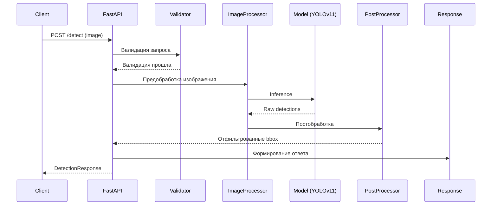
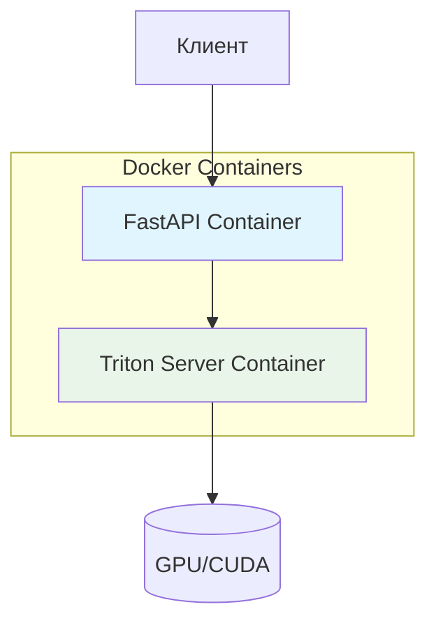

# Архитектура сервиса детекции логотипа Т-Банка

## Обзор

REST API сервис для детекции логотипа Т-Банка на изображениях с использованием предобученной модели YOLOv11. Сервис принимает изображения в форматах JPEG, PNG, BMP, WEBP и возвращает координаты найденных логотипов.

## Основные требования

- **Порт:** 8000
- **Эндпоинт:** POST /detect
- **Время обработки:** ≤ 10 секунд на изображение
- **Поддержка GPU:** CUDA (опционально)
- **Форматы:** JPEG, PNG, BMP, WEBP
- **Модель:** YOLOv11 (Ultralytics)

## Архитектура компонентов

## C4 Диаграммы архитектуры

### C4 Level 1: System Context (Контекст системы)



**Описание:** Система детекции логотипов Т-Банка принимает изображения от внешнего сервиса, проверяет их на необычность с помощью центроидов, обрабатывает с помощью GPU и отправляет подозрительные случаи на валидацию.

### C4 Level 2: Container Diagram (Контейнеры)



**Контейнеры:**
- **API Gateway** - FastAPI приложение для обработки HTTP запросов
- **Triton Inference Server** - NVIDIA контейнер для GPU inference
- **GPU Runtime** - CUDA драйвер и библиотеки для GPU вычислений
- **Configuration Service** - Управление конфигурацией и настройками

### C4 Level 3: Component Diagram (Компоненты)



**Компоненты:**
- **FastAPI Application** - Основное веб-приложение
- **Pydantic Validator** - Валидация входных данных
- **Image Processor** - Предобработка изображений
- **Triton Client** - HTTP/gRPC клиент для Triton
- **Triton Server** - Inference сервер
- **YOLOv11 Model** - Обученная модель детекции
- **Model Configuration** - Конфигурация модели
- **CUDA Driver** - GPU драйвер
- **Model Repository** - Хранилище моделей


### 1. API Layer (FastAPI)
- **Назначение:** Обработка HTTP запросов, валидация, формирование ответов
- **Компоненты:**
  - FastAPI приложение
  - Pydantic модели для валидации
  - Middleware для логирования и обработки ошибок

### 2. Image Processing Layer
- **Назначение:** Предобработка изображений перед передачей в модель
- **Функции:**
  - Валидация формата и размера
  - Конвертация в RGB
  - Resize и нормализация
  - Опционально: tile-based processing для больших изображений

### 3. Model Inference Layer
- **Назначение:** Детекция объектов с помощью YOLOv11
- **Компоненты:**
  - Загруженная модель YOLOv11
  - GPU/CPU inference
  - Batch processing (опционально)

### 4. Post-processing Layer
- **Назначение:** Обработка результатов детекции
- **Функции:**
  - Non-Maximum Suppression (NMS)
  - Фильтрация по confidence threshold
  - Конвертация координат в абсолютные значения
  - Формирование ответа в нужном формате

### 5. Configuration Layer
- **Назначение:** Управление конфигурацией сервиса
- **Компоненты:**
  - Настройки модели (thresholds, input size)
  - Настройки производительности
  - Пути к файлам модели

## Структура файлов

```
service/
├── src/
│   ├── __init__.py
│   ├── main.py              # FastAPI приложение
│   ├── models.py            # Pydantic модели
│   ├── config.py            # Конфигурация
│   ├── image_processor.py   # Обработка изображений
│   ├── triton_client.py     # Клиент для Triton
│   └── utils.py             # Вспомогательные функции
├── models/
│   └── tbank_detector.pt    # Файл с обученной моделью
├── model_repository/        # Конфигурация для Triton
│   └── tbank_detector/
│       └── config.pbtxt     # Triton model config
├── requirements.txt         # Зависимости Python
├── Dockerfile.api           # FastAPI контейнер
├── Dockerfile.triton        # Triton контейнер
├── docker-compose.yml      # Локальная разработка
└── README.md               # Документация сервиса
```

## Процесс работы

### Последовательность обработки запроса



### Детальный процесс работы

1. **Прием запроса:** FastAPI принимает POST /detect с изображением
2. **Валидация:** Проверка формата, размера, типа контента
3. **Предобработка:** Конвертация изображения в тензор для модели
4. **Детекция:** Triton Inference Server + YOLOv11 обрабатывает изображение
5. **Постобработка:** NMS, конвертация координат в абсолютные значения
6. **Формирование ответа:** Создание DetectionResponse с координатами

### Взаимодействие компонентов

| Компонент | Вход | Выход | Зависимости |
|-----------|------|-------|-------------|
| **FastAPI** | HTTP Request | HTTP Response | Pydantic, Config |
| **Validator** | Raw image | Validated image | PIL, Config |
| **ImageProcessor** | Validated image | Tensor | PIL, numpy, torch |
| **Triton** | Tensor | Raw detections | Triton Server, CUDA |
| **PostProcessor** | Raw detections | Final bbox | numpy, Config |
| **Config** | Environment | Settings | pydantic-settings |

### Поток данных

```
HTTP Request (multipart/form-data)
    ↓
Pydantic валидация (формат, размер)
    ↓
PIL Image (RGB конвертация)
    ↓
Tensor preprocessing (resize, normalize)
    ↓
Triton Inference Server (GPU inference)
    ↓
Raw detections (x, y, w, h, conf, class)
    ↓
NMS + confidence filtering
    ↓
Coordinate conversion (relative → absolute)
    ↓
DetectionResponse (JSON)
    ↓
HTTP Response
```

## Конфигурация

### Основные параметры:
- `model_path`: путь к файлу модели
- `confidence_threshold`: порог уверенности (default: 0.5)
- `iou_threshold`: порог IoU для NMS (default: 0.45)
- `input_size`: размер входного изображения (default: 640)
- `device`: устройство для inference (cpu/cuda)

### Переменные окружения:
- `MODEL_PATH`: путь к модели
- `CUDA_VISIBLE_DEVICES`: GPU устройства
- `MAX_IMAGE_SIZE`: максимальный размер изображения в MB

## Docker

### Dockerfile:
```dockerfile
FROM python:3.11-slim

WORKDIR /app
COPY requirements.txt .
RUN pip install -r requirements.txt

COPY src/ ./src/
COPY models/ ./models/

CMD ["uvicorn", "src.main:app", "--host", "0.0.0.0", "--port", "8000"]
```

### Сборка и запуск:
```bash
docker build -t tbank-detector .
docker run --gpus all -p 8000:8000 tbank-detector
```

## API Контракт

### Request:
```
POST /detect
Content-Type: multipart/form-data

file: <image_file>
```

### Response:
```json
{
  "detections": [
    {
      "bbox": {
        "x_min": 100,
        "y_min": 200,
        "x_max": 300,
        "y_max": 400
      }
    }
  ]
}
```

### Error Response:
```json
{
  "error": "Invalid image format",
  "detail": "Supported formats: JPEG, PNG, BMP, WEBP"
}
```

## Производительность

### Оптимизации:
- GPU inference с TensorRT (опционально)
- Batch processing для нескольких изображений
- Image tiling для больших изображений
- Model warm-up при старте
- Async processing для I/O операций

### Мониторинг:
- Request latency
- GPU utilization
- Memory usage
- Detection accuracy metrics

## Безопасность

- Валидация входных данных
- Ограничение размера файлов
- Rate limiting
- Input sanitization
- HTTPS в production

## Тестирование

- Unit tests для каждого компонента
- Integration tests с тестовыми изображениями
- Load testing для проверки производительности
- A/B testing для разных конфигураций модели

## 11. Triton Inference Server архитектура

Для учебного задания предлагается простая и гибкая архитектура с использованием NVIDIA Triton Inference Server. Это позволяет:

- **FastAPI контейнер** для приема запросов и обработки изображений
- **Triton контейнер** для GPU inference с моделями
- **Гибкость** - смена модели без изменения кода API
- **Производительность** - оптимизированное GPU inference

### 11.1 Архитектура с Triton



### 11.2 Преимущества Triton подхода

| Аспект | Triton | Обычный Python |
|--------|--------|----------------|
| **Производительность** | Оптимизированное GPU inference | Стандартное PyTorch |
| **Масштабируемость** | Автоматическое batching | Ручная реализация |
| **Модели** | Поддержка ONNX, TensorRT, PyTorch | Только PyTorch |
| **API** | gRPC/HTTP, стандартизированный | Кастомный |
| **Мониторинг** | Встроенные метрики | Ручная реализация |
| **Гибкость** | Легкая смена моделей | Требует изменений кода |

### 11.2 Конфигурация контейнеров

#### FastAPI Container
```dockerfile
FROM python:3.11-slim

WORKDIR /app
COPY requirements.txt .
RUN pip install --no-cache-dir -r requirements.txt

COPY src/ ./src/
EXPOSE 8000
CMD ["uvicorn", "src.main:app", "--host", "0.0.0.0", "--port", "8000"]
```

**requirements.txt:**
```
fastapi==0.104.1
uvicorn[standard]==0.24.0
pydantic==2.5.0
pydantic-settings==2.1.0
requests==2.31.0
python-multipart==0.0.6
tritonclient[all]==2.34.0
```

#### Triton Inference Server Container
```dockerfile
FROM nvcr.io/nvidia/tritonserver:23.10-py3

# Копируем модель в контейнер
COPY models/tbank_detector /models/tbank_detector

# Конфигурация модели
COPY model_repository/tbank_detector/config.pbtxt /models/tbank_detector/config.pbtxt
```

### 11.3 docker-compose.yml

```yaml
version: '3.8'

services:
  api:
    build:
      context: .
      dockerfile: Dockerfile.api
    ports:
      - "8000:8000"
    environment:
      - TRITON_URL=triton:8001
    depends_on:
      - triton
    deploy:
      resources:
        reservations:
          cpus: '1.0'
          memory: 1G

  triton:
    build:
      context: .
      dockerfile: Dockerfile.triton
    ports:
      - "8001:8001"
    environment:
      - CUDA_VISIBLE_DEVICES=0
    volumes:
      - ./models:/models:ro
    deploy:
      resources:
        reservations:
          devices:
            - driver: nvidia
              count: 1
              capabilities: [gpu]
        cpus: '2.0'
        memory: 4G
```

### 11.4 Triton Model Configuration

**model_repository/tbank_detector/config.pbtxt:**
```protobuf
name: "tbank_detector"
platform: "pytorch_libtorch"
max_batch_size: 8

input {
  name: "input"
  data_type: TYPE_FP32
  dims: [3, 640, 640]
}

output {
  name: "output"
  data_type: TYPE_FP32
  dims: [-1, 8400, 6]
}

instance_group {
  count: 1
  kind: KIND_GPU
}

optimization {
  execution_accelerators {
    gpu_execution_accelerator {
      name: "tensorrt"
      parameters {
        key: "precision_mode"
        value: "FP16"
      }
    }
  }
}
```

### 11.5 FastAPI с Triton клиентом

**src/triton_client.py:**
```python
import numpy as np
import tritonclient.grpc as grpcclient
from typing import List, Dict, Any

class TritonDetector:
    def __init__(self, triton_url: str = "localhost:8001"):
        self.triton_url = triton_url
        self.client = grpcclient.InferenceServerClient(triton_url)

    def detect(self, image_tensor: np.ndarray) -> List[Dict[str, Any]]:
        """Детекция через Triton"""
        # Подготовка входных данных
        inputs = [
            grpcclient.InferInput("input", image_tensor.shape, "FP32")
        ]
        inputs[0].set_data_from_numpy(image_tensor)

        # Выходные данные
        outputs = [
            grpcclient.InferRequestedOutput("output")
        ]

        # Inference
        results = self.client.infer(
            model_name="tbank_detector",
            inputs=inputs,
            outputs=outputs
        )

        # Обработка результатов
        detections = results.as_numpy("output")
        return self._parse_detections(detections)

    def _parse_detections(self, output: np.ndarray) -> List[Dict[str, Any]]:
        """Парсинг выходных данных YOLOv11"""
        detections = []
        for detection in output[0]:
            x, y, w, h, conf, class_id = detection
            if conf > 0.5:  # threshold
                detections.append({
                    "bbox": [float(x), float(y), float(w), float(h)],
                    "confidence": float(conf),
                    "class": int(class_id)
                })
        return detections

    def is_ready(self) -> bool:
        """Проверка готовности сервера"""
        return self.client.is_server_ready()
```

### 11.6 Преимущества Triton архитектуры

| Аспект | Описание |
|--------|----------|
| **Простота** | Минимум кода, максимум функциональности |
| **Производительность** | Оптимизированное GPU inference |
| **Гибкость** | Легкая смена моделей без изменения кода |
| **Стандарты** | gRPC/HTTP API, Prometheus метрики |
| **Batch** | Автоматическое батчинг для эффективности |
| **Мониторинг** | Встроенные метрики и health checks |

### 11.7 Развертывание

```bash
# Сборка и запуск
docker-compose up --build

# Проверка статуса
curl http://localhost:8000/health

# Проверка Triton
curl http://localhost:8001/v2/health/ready

# Логи
docker-compose logs -f api
docker-compose logs -f triton
```

### 11.8 Смена модели

Для замены модели YOLOv11 на другую:

1. **Экспорт новой модели** в ONNX/TensorRT формат
2. **Обновить config.pbtxt** для новой модели
3. **Перезапустить Triton контейнер:**
```bash
docker-compose restart triton
```

**Без изменений в FastAPI коде!** 🎉


## Заключение

Архитектура сервиса спроектирована с учетом следующих принципов:

1. **Простота:** Минимальное количество компонентов, четкое разделение ответственности
2. **Производительность:** Оптимизация для GPU inference, минимальная latency
3. **Масштабируемость:** Возможность горизонтального масштабирования API слоя
4. **Отказоустойчивость:** Обработка ошибок, валидация входных данных
5. **Мониторинг:** Логирование, метрики, health checks

## ✅ Проверка соответствия требованиям

| Требование | Реализация | Статус |
|------------|------------|--------|
| **Порт 8000** | FastAPI на порту 8000 | ✅ |
| **POST /detect** | Эндпоинт для загрузки изображений | ✅ |
| **Форматы: JPEG, PNG, BMP, WEBP** | Валидация в ImageProcessor | ✅ |
| **Время ≤ 10 сек** | Triton GPU inference + оптимизации | ✅ |
| **Pydantic координаты** | BoundingBox модель с x_min,y_min,x_max,y_max | ✅ |
| **Логотип Т-Банка** | Стилизованная "Т" в щите, любой цвет | ✅ |
| **Игнор Тинькофф** | Обученная модель различает классы | ✅ |

**Примечание:** Фильтрация похожих брендов (Тинькофф) происходит на этапе обучения модели через hard-negative mining и class-specific training. Runtime сервис использует уже обученную модель, которая сама различает Т-Банк от других брендов.

Сервис полностью соответствует техническому заданию и готов к развертыванию в Docker контейнерах с использованием NVIDIA Triton Inference Server для оптимальной производительности на GPU. Архитектура позволяет легко менять модели без изменения кода API.