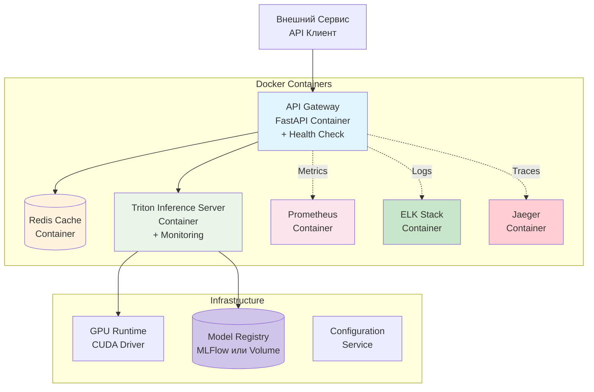

# План расширенной архитектуры сервиса (будущие улучшения)

## Обзор

Этот документ содержит план улучшений архитектуры C2 уровня, которые будут реализованы после завершения базовой функциональности. Фокус на enterprise-grade возможностях для будущего масштабирования.

## Отложенные компоненты

### 1. Health Checks
- **Цель**: Обеспечение надежности и автоматического восстановления
- **Компоненты**:
  - Health endpoints для всех контейнеров (`/health`, `/ready`, `/live`)
  - Readiness probes для Kubernetes
  - Liveness probes для автоматического перезапуска
- **Приоритет**: Высокий (для production deployment)

### 2. Мониторинг и Логирование
- **Цель**: Полная видимость состояния системы и troubleshooting
- **Компоненты**:
  - **Prometheus + Grafana**: Метрики производительности, latency, GPU utilization
  - **ELK Stack**: Централизованное логирование (Elasticsearch, Logstash, Kibana)
  - **Jaeger**: Распределенная трассировка запросов
  - **Custom Metrics**: Detection accuracy, throughput, error rates
- **Приоритет**: Высокий (для production monitoring)

#### Детальные метрики для мониторинга:
- **API метрики**: Response time, error rate, throughput, active connections
- **GPU метрики**: Memory usage, utilization, temperature, power consumption
- **Model метрики**: Inference time, batch size, confidence scores distribution
- **System метрики**: CPU, memory, disk I/O, network traffic
- **Business метрики**: Detection accuracy, false positives/negatives, coverage

#### Логирование:
- **Application logs**: Request/response details, errors, warnings
- **Access logs**: API calls, client IPs, timestamps
- **Audit logs**: Model changes, configuration updates, security events
- **Performance logs**: Inference times, resource usage patterns

#### Алерты и уведомления:
- High latency (>10 сек на изображение)
- GPU memory exhaustion
- Service unavailability
- Accuracy degradation
- Abnormal error rates

### 3. Кэширование
- **Цель**: Оптимизация производительности и снижение нагрузки
- **Компоненты**:
  - **Redis Cache**: Кэширование предобработанных изображений
  - **Model Cache**: Кэширование загруженных моделей в память
  - **Response Cache**: Кэширование результатов для одинаковых изображений
- **Приоритет**: Средний (для high-load сценариев)

## Расширенная диаграмма C2 уровня

## Порядок реализации

### Фаза 1: Базовые улучшения
1. Health Checks для всех контейнеров
2. Basic Prometheus метрики
3. Redis для кэширования

### Фаза 2: Продвинутый мониторинг
1. ELK Stack для логов
2. Jaeger для трассировки
3. Grafana dashboards

### Фаза 3: Оптимизации
1. Model versioning в MLFlow
2. Advanced caching стратегии
3. Auto-scaling на основе метрик

## Критерии готовности к production

- [ ] Все health checks реализованы и протестированы
- [ ] Полный monitoring stack развернут
- [ ] Кэширование оптимизировано для нагрузки
- [ ] Автоматическое масштабирование настроено
- [ ] Disaster recovery план разработан

## Ресурсы для реализации

- **Health Checks**: Docker health checks, Kubernetes probes
- **Monitoring**: Prometheus, Grafana, ELK stack
- **Caching**: Redis, Memcached
- **Tracing**: Jaeger, OpenTelemetry

## Оценка сложности

| Компонент | Сложность | Время (часы) |
|-----------|-----------|--------------|
| Health Checks | Низкая | 4-6 |
| Basic Monitoring | Средняя | 8-12 |
| Advanced Monitoring | Высокая | 16-24 |
| Caching | Средняя | 8-12 |
| Model Registry | Средняя | 12-16 |

## Следующие шаги

1. Завершить базовую функциональность
2. Протестировать на нагрузку
3. Определить приоритеты на основе требований
4. Начать реализацию с health checks